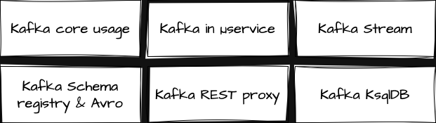

= Kafka Camp Complete Coverage

NOTE: This camp uses Spring Boot 3.x and Apache Camel 4.x LTS, & all µServices will be exposed by Camel REST

== Links

- https://github.com/apache/camel-spring-boot-examples[Camel Spring Boot Samples]
- https://docs.confluent.io/platform/current/quickstart/ce-docker-quickstart.html[Quick Start for Confluent Platform]
- https://github.com/json-path/JsonPath[JsonPath Git]

.Journey's Coverage Path

.Common Properties
[source,properties]
----
camel.springboot.name=kafka.intro
spring.main.web-application-type=none

# expose actuator endpoint via HTTP
management.endpoints.web.exposure.include=info,health,camelroutes

# turn on actuator health check
management.endpoint.health.enabled=true

# allow obtaining basic information about camel routes (read only mode)
management.endpoint.camelroutes.enabled=true
management.endpoint.camelroutes.read-only=true

camel.threadpool.pool-size = 3
camel.threadpool.max-pool-size = 3

camel.springboot.main-run-controller=true

# Kafka Common Configurations
camel.component.kafka.brokers=localhost:9092
camel.component.kafka.key-serializer=org.apache.kafka.common.serialization.StringSerializer
camel.component.kafka.value-serializer=org.apache.kafka.common.serialization.StringSerializer

# Kafka Producer Configurations

# Kafka Consumer Configurations
#camel.component.kafka.seek-to=beginning
camel.component.kafka.group-id=my-topic-01-group-01
camel.component.kafka.consumers-count=3
# latest is default value
#camel.component.kafka.auto-offset-reset=earliest
----

== Kafka Import Topics

. Basically, we've the following capabilities, publish and subscribe to streams of records similar to a message queue or enterprise msg system with a storing system with fault tolerance and durable way and real time
. Kafka stores messages using publish and subscribe mechanisms
. Inside a Topic we have one or more partitions and inside them have Offsets that are incremented independently
. The Message is stored 7 days by default
. Partitions are like Threads in Java, they are the way to achieve parallelism in Kafka
. Messages are stored in order for each partition, and order across partitions isn't guaranteed, unless a key is used
. #_Kafka will only allow maximum ONE consumer per partition, e.g.; if we have three partitions and four consumers, one of these consumers will stay idle forever_#, but it is not always a bad idea, if one of these consumers down, kafka will bind the idle consumer to read the message, Kafka by default will assign a consumer per partition
. Brokers, e.g., represent a replication factor; replication-factor 2 means two kafka brokers
. We can instruct the kafka to use a specific partition using the _key_ concept
. Topic can increase according to your necessity
. Sample to every minute fetch data to topic _t-commodity-price_, using timestamp, commodity type with three partitions
. Classifying delivery semantic we have, #_at-most-once_#, here the offset is committed immediately after reader, if any error occurs we can have some message loss, other is #_at-least-once_# here when the offset is committed if anything goes wrong the offset should not commit, means that the consumer will re-process the message, in this case we need to ensure that our consumer has idempotent behavior, and the last is #_exactly-once_# will be processed only once, but hard to implement

.Message Filter Spring Sample
[source,java]
----
import org.springframework.boot.autoconfigure.kafka.ConcurrentKafkaListenerContainerFactoryConfigurer;
import org.springframework.kafka.config.ConcurrentKafkaListenerContainerFactory;

class KafkaConsumer {

  @KafkaListener(topics="x", groupId="xx", containerFactory="beanX")
  void listenerFiltered(String message) {

  }

  @Bean
  ConcurrentKafkaListenerContainerFactory<Object, Object> beanX(
          ConcurrentKafkaListenerContainerFactoryConfigurer configurer) {
    var factory = new ConcurrentKafkaListenerContainerFactory<Object, Object>();
    //
    factory.setRecordFilterStrategy(consumerRecord ->
       bean.fieldX < 10
    );
  }
}
----

.Re-Balancing Topic
[source, bash]
----
kafka-topic.sh --bostrap-server localhost:9092 --alter --topic XXX --partition 2
----

[source,java]
----
import org.apache.kafka.clients.consumer.ConsumerRecord;import org.springframework.kafka.listener.ConsumerAwareListenerErrorHandler;
class MyGlobalException implements ConsumerAwareListenerErrorHandler {
  void handle(Exception x, ConsumerRecord<?, ?> data, Consumer<?, ?> consumer) {
    // TODO:
  }
}
----